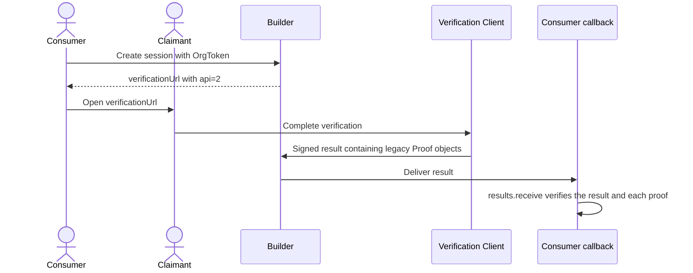

# Run a Builder v2 consumer demo

This demo creates a Builder session, prints the claimant's `api=2` URL,
receives one signed callback, and verifies the result before it prints trusted
claim data. It never sends a Verification Client UUID or private key to the
claimant.

It works with Builder's built-in Verification Client or any registered
Builder-compatible client, including the portal and mobile clients.



## What the demo verifies

`reclaim.results.receive` performs the complete server-side verification path:

1. Decrypts the callback with the organization's Ethereum private key when
   result encryption is enabled.
2. Resolves the session's registered Verification Client issuer and trusted
   JSON Web Key Set (JWKS) URL.
3. Verifies the outer ES256K JSON Web Signature (JWS), session ID, organization
   audience, and expiry.
4. Runs the package's legacy-compatible `verifyProof` for every exact proof.
5. Checks trusted attestors, proof signatures, and provider/request hashes
   against the immutable Builder recipes.
6. Optionally verifies the legacy-compatible TEE nonce and session binding.

Use only `proof.data` returned after this call for application decisions. Outer
`extracted_parameters` fields are diagnostics, not trusted claim data. If
`results.receive` throws `ResultVerificationError`, the demo exits with a
failure and does not use the callback payload.

## Configure the demo

Copy the example environment file and replace its placeholders:

```bash
cp .env.example .env
```

Set the required values:

| Variable | Purpose |
| --- | --- |
| `RECLAIM_ORG_SECRET` | Organization secret (`rorg_…`) used as the Builder OrgToken. Keep it server-side. |
| `ORG_ID` | Expected result audience and organization addressed by setup. |
| `PROVIDER_ID` | One provider UUID or a comma-separated ordered list. |
| `BUILDER_API_URL` | Builder origin. Defaults to `http://localhost:4001`. |
| `CALLBACK_URL` | Callback registered on the organization. It must be reachable by Builder. |

`PROVIDER_VERSION` can be blank, exact, or an npm semantic-version range:

| Value | Builder resolution |
| --- | --- |
| Blank | Latest active trunk version. |
| `1.2.3` | Exact active version. |
| `^1.2.0` | Highest active version satisfying the range. |

### Select a Verification Client

Leave `VERIFICATION_CLIENT_URL` blank to use Builder's built-in client. To use
the portal, verifier app, or another client, set it to that client's exact
registered base URL:

```dotenv
VERIFICATION_CLIENT_URL=https://portal.example.com/
```

Builder resolves that URL to a registered Verification Client UUID and returns
a URL containing the session ID and `api=2`. The consumer never sends a
Verification Client UUID.

Client-owned redirect values can be appended after session creation:

```dotenv
VERIFICATION_CLIENT_QUERY=redirectUrl=https%3A%2F%2Fmerchant.example%2Fdone
```

The demo rejects attempts to override Builder-owned `api` or `sessionId`
parameters. Query parameter names are client-specific; Builder does not store,
validate, or execute redirects.

### Optional callback encryption

To encrypt signed results to the organization:

```dotenv
CAN_USE_ENCRYPTION=true
RECLAIM_ETH_PRIVATE_KEY=0x<64-hex-character-private-key>
```

Setup derives and registers only the public secp256k1 key. The private key
stays in the consumer process and decrypts callback data locally. With
`CAN_USE_ENCRYPTION=false`, setup disables result encryption and callbacks
contain a plaintext—but still signed—JWS.

### Optional TEE session binding

For a TEE-capable Verification Client, enable the legacy-compatible session
nonce:

```dotenv
CAN_BIND_TEE=true
RECLAIM_ETH_PRIVATE_KEY=0x<organization-verification-private-key>
```

The client package creates the session first, derives and signs the nonce
locally, and binds it through Builder. The private key is not sent to Builder.
The callback verifier uses the same key to validate the proof's TEE binding.

## Create, launch, receive, and verify

Install dependencies, configure the organization, and type-check the demo:

```bash
npm install
npm run check
npm run setup
```

Setup:

- registers or updates the organization's public key when one is configured;
- sets callback encryption to the requested state; and
- creates the signed-result callback subscription if an identical one doesn't
  already exist.

The subscription includes `verification_success`, `verification_rejected`, and
`verification_error`. Cancellation and expiry are useful operational events,
but they do not contain a signed proof result.

Start the listener and create a Builder session:

```bash
npm start
```

Open the printed URL as the claimant and complete verification. The process
waits for the callback, runs `results.receive`, and prints verified proof
metadata and trusted data. The flow stops on a failed callback verification;
do not retry it by treating the Builder link as a legacy request.

For a local Builder, use `http://localhost:4010/callback`. When using a remote
Builder deployment, set `CALLBACK_URL` to an HTTPS endpoint or tunnel that can
reach this process. The local Express listener uses the path from
`CALLBACK_URL`, so a public URL ending in `/reclaim/callback` listens locally
on that same path.

## Production differences

The callback in this demo stores one delivery in memory. A production handler
should:

- acknowledge quickly after durably storing the delivery;
- handle at-least-once delivery and deduplicate by session and event;
- run `results.receive` on a trusted server, never in claimant-facing code;
- provide the expected session ID and organization audience explicitly;
- keep organization private keys in a secret manager or signing service; and
- avoid logging proof contents or claimant personal data.

Never commit `.env`, private keys, or callback payloads. The included
`.gitignore` excludes common local key files.
# builder-consumer-demo
